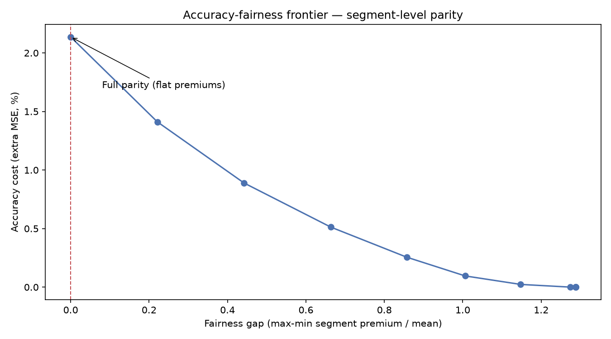
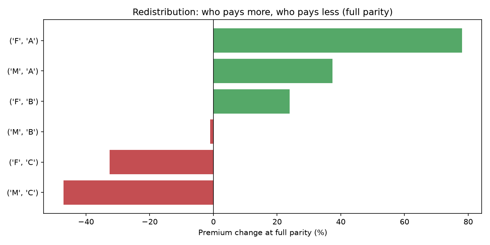
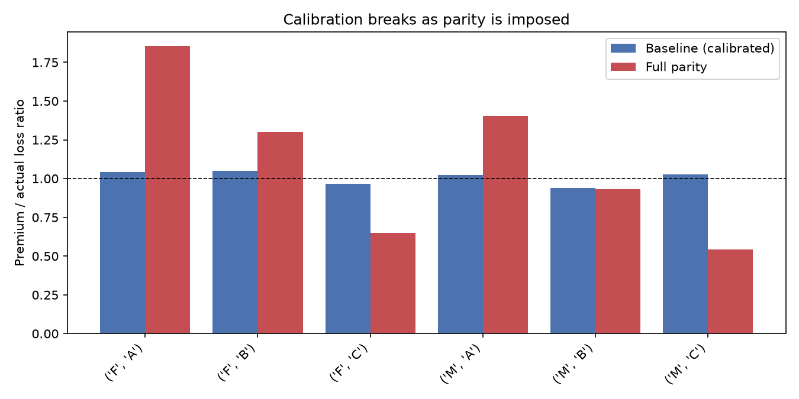
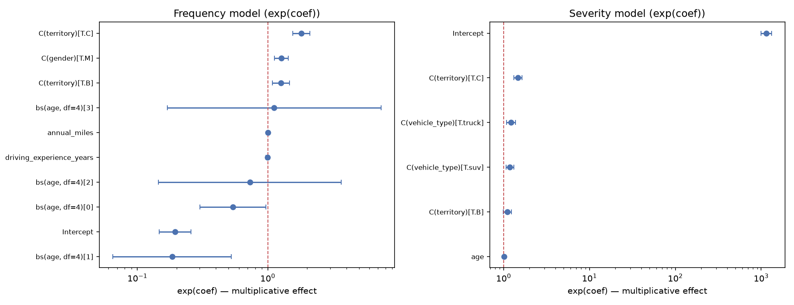

# The Price of Fairness: Constrained Risk Pricing

> What does fairness actually cost in risk pricing — in accuracy, in calibration, and in who pays more?

An end-to-end actuarial pricing project: a risk-pricing pipeline (Poisson
frequency + Gamma severity GLMs), a fairness audit layer, constrained pricing
via convex optimization, and an accuracy-fairness frontier that shows who pays
the price of equality.

**Status:** complete — 13 tests passing, 4 notebooks executed end-to-end,
interactive dashboard, CI enabled, public-data test applications included.

## Why this matters to pricing teams

This is not a "fit a GLM" exercise. It is the workflow an insurance pricing
team (or regulator) runs when asked: *"what happens if we stop using variable
X?"* Each artifact maps to a real business need:

| Business question | Artifact |
|---|---|
| What should the rate be? | Frequency + severity GLMs → pure premiums (notebook 02) |
| Is our model fair? | Fairness audit: base rates, demographic parity, equalized odds, calibration (notebook 03) |
| What does banning a variable cost? | Convex-optimized constrained pricing → accuracy-fairness frontier (notebook 04) |
| Who pays / who wins? | Redistribution and cross-subsidy analysis (notebook 04, dashboard) |
| Can we defend this to a regulator? | [Model card](docs/model_card.md), [regulatory mapping](docs/regulatory_mapping.md), methodology memo |
| Will it break tomorrow? | 13 unit tests + GitHub Actions CI that re-runs tests *and* all notebooks |

The project mirrors what regulators are now demanding (EU AI Act
high-risk classification for insurance pricing, Colorado SB 169 unfair
discrimination testing, NAIC AI Model Bulletin) — see
[docs/regulatory_mapping.md](docs/regulatory_mapping.md).

## Repository structure

- `data/` — synthetic policy/claim generator + committed sample
- `notebooks/` — 01 EDA, 02 pricing baseline, 03 fairness audit, 04 constrained frontier
- `src/` — models, fairness metrics, constrained pricing (QP)
- `dashboard/` — Streamlit explorer
- `docs/` — methodology, fairness memo, model card, regulatory mapping
- `results/` — precomputed tables and charts
- `tests/` — 13 unit tests
- `test_public_examples/` — pipeline applied to UCI Adult and freMTPL2 (marked TEST)
- `.github/workflows/ci.yml` — tests + notebook execution on every push

## How to run

Requires Python 3.10+.

1. `python -m venv .venv` and activate it
2. `pip install -r requirements.txt`
3. Regenerate the full 100K dataset (optional; a 10K sample is committed):
   `python data/generate_data.py --n-policies 100000 --output data/claims_full.csv`
4. Walk the notebooks:
   - `notebooks/01_eda.ipynb`
   - `notebooks/02_baseline.ipynb`
   - `notebooks/03_fairness.ipynb`
   - `notebooks/04_constrained.ipynb`
5. Explore interactively: `streamlit run dashboard/app.py`
6. Run the tests: `pytest`

## Key findings

* **The baseline is accurate but unfair.** Segment calibration spans
  0.94–1.05 and the holdout loss ratio is 1.04, yet mean premiums run from
  $273 (F/A) to $919 (M/C) — a **3.4× spread** driven by base-rate
  differences (F claim rate 10.6% vs M 13.5%).
* **The model self-corrects.** The first version used a linear age term and
  mispriced age bands badly (young drivers undercharged 37%, middle-aged
  overcharged ~50%). Switching to age splines fixed age calibration to
  0.95–1.05 — and the regression test prevents it from coming back.
* **Fairness metrics conflict by mathematics, not by bug.** Calibration
  holds (predicted/actual 0.997–1.010 by gender) while demographic parity
  and equalized odds fail (TPR 0.50 F vs 0.68 M); TPR parity would need
  thresholds 0.131 (F) vs 0.164 (M) — Chouldechova's impossibility.
* **Full demographic parity costs +2.1% MSE and moves 35% of premium
  volume** — a massive cross-subsidy from low-risk (F/A +78%) to high-risk
  (M/C −47%) segments.
* **A single-variable ban is cheap.** Gender-only parity (the EU-style rule)
  costs +0.14% MSE and moves 12% of premium volume.
* **Parity breaks calibration on purpose.** At full parity, premium/actual
  ratios swing from 0.54 (M/C, undercharged) to 1.85 (F/A, overcharged).
* **Parity distorts loss ratios.** The per-segment loss-ratio gap widens
  from 0.13 to 1.30 at full parity (aggregate stays 1.00 by budget
  neutrality) — the cross-subsidy in actuarial terms.
* **Results are robust at 100K policies.** The full dataset reproduces the
  same frontier shape (calibration 0.98–1.02, full parity +1.8% MSE).

## Results

All tables and charts are in `results/`; full derivations are in
[`docs/methodology.md`](docs/methodology.md).

## Documentation

- [Methodology](docs/methodology.md) — full math and results
- [Fairness memo](docs/fairness_memo.md) — the story for non-technical readers
- [Model card](docs/model_card.md) — intended use, metrics, limitations
- [Regulatory mapping](docs/regulatory_mapping.md) — EU AI Act, Colorado SB 169, NAIC

## Public-data applications (TEST)

The same pipeline runs on [UCI Adult and freMTPL2](test_public_examples/README.md),
marked as experiments.

## Versions & rollback

Every update is tagged (`v1.0.0` ... `v1.6.2`) and released on GitHub, so any
previous version can be restored if something goes wrong. See
[docs/versioning.md](docs/versioning.md) for the version history and
restore instructions.

## License

MIT — see [LICENSE](LICENSE).
